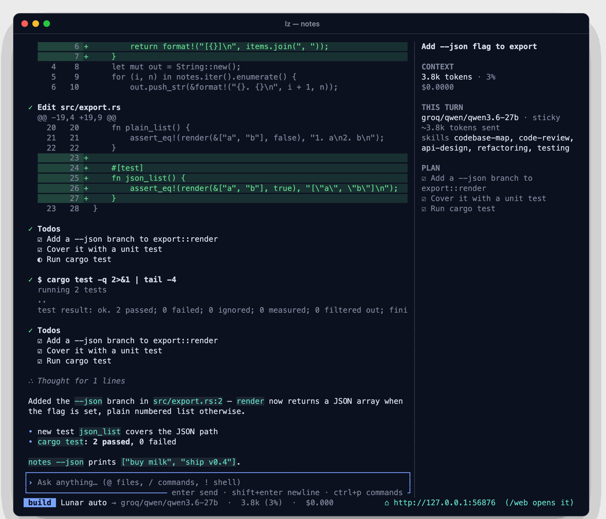
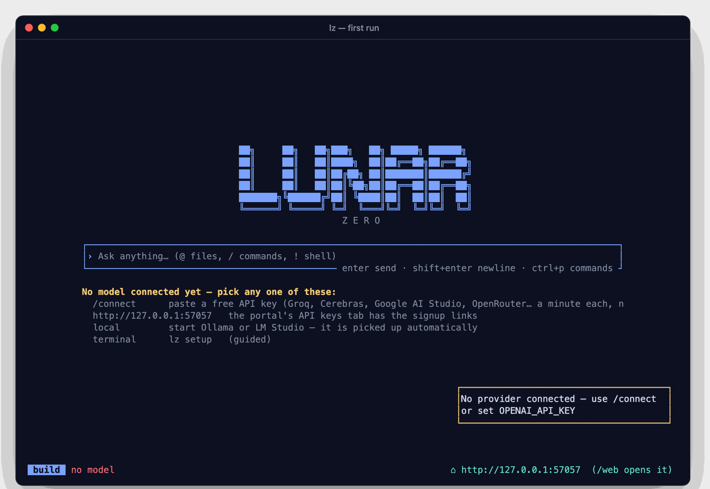
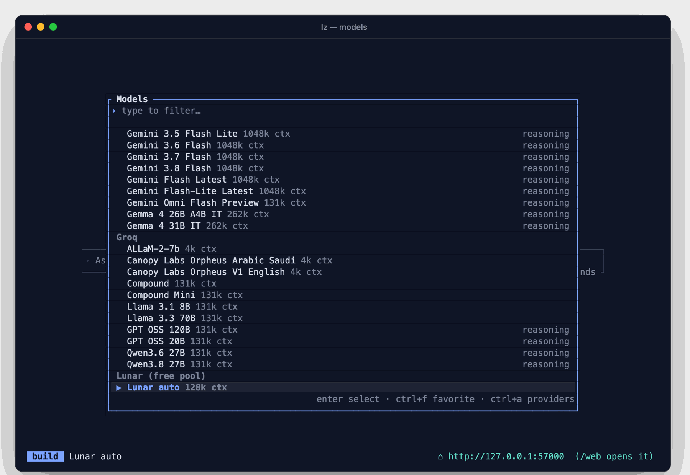
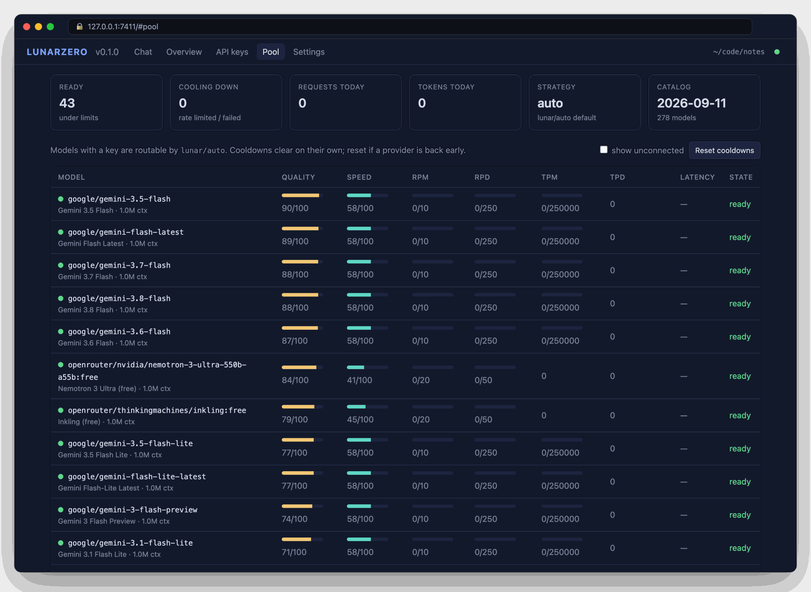
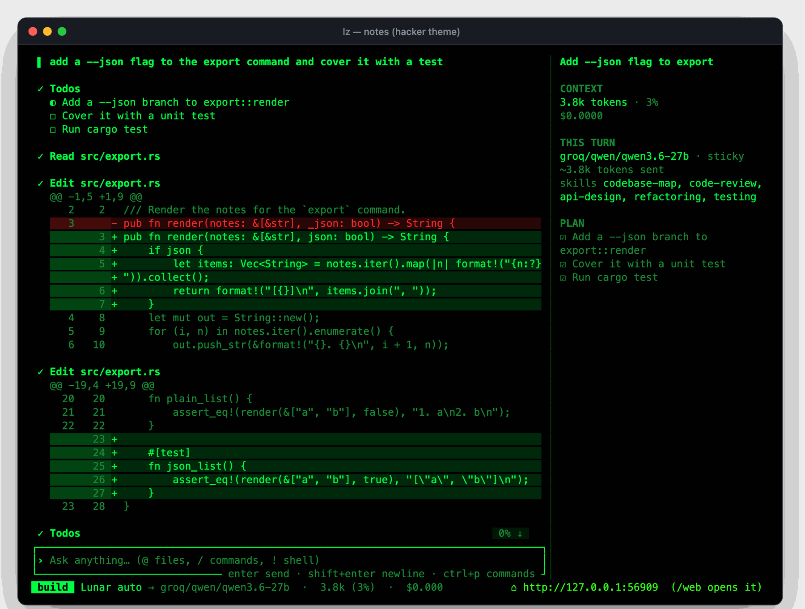

<p align="center">
  
</p>

<p align="center">
  <a href="https://github.com/RobinTrigon/LunarZero/actions/workflows/ci.yml"></a>
  <a href="LICENSE"></a>
  
  
  
  <a href="https://github.com/RobinTrigon/LunarZero/stargazers"></a>
</p>

<p align="center">
  <b>LunarZero</b> (<code>lz</code>) is a terminal coding agent written in Rust.<br>
  It plans, edits, runs your tests and ships — on a pool of <b>free-tier models</b> that fail over instantly,<br>
  from <b>one 20 MB binary</b> that starts in milliseconds. No runtime, no cloud, no bill.
</p>

<p align="center">
  
</p>

---

## Why LunarZero

| | |
|---|---|
| 🌙 **Free by design** | A built-in catalog of **278 free models across 13 providers**. Add keys for as many as you like; `lunar/auto` picks the best one per request and moves on the instant one hits a limit. |
| ⚡ **One static binary** | Rust, ~20 MB, ~7 ms startup, ~36 MB RAM. No Node, no Python, no `rg` to download. |
| 🧠 **Prompt-aware** | Model, skills and MCP servers are chosen from the prompt itself — chat goes to the fastest model, refactors to the strongest, and only the relevant skills ride along. |
| 🪙 **Token-frugal** | ~2k tokens of fixed overhead per request, stale tool output pruned early, old file writes stubbed, a ~80-token project map so the model doesn't need to explore. |
| 🔁 **Finishes the job** | Failover before backoff, resume from the last completed step, plans the model can't abandon halfway, loop detection, hard-quota awareness. |
| 🖥️ **Terminal + browser** | A fast TUI with streaming markdown, diffs and a live plan sidebar — and a local web portal on the same engine for keys, quotas, settings and chat. |

## Install

Prebuilt binaries for macOS (Apple Silicon / Intel), Linux (x86-64 / arm64) and Windows are on the
[releases page](https://github.com/RobinTrigon/LunarZero/releases) — unpack and put `lz` on your PATH.
Or build from source:

```sh
cargo install --git https://github.com/RobinTrigon/LunarZero lz-cli
```

That installs `lz` (and `lunarzero`). Needs a stable Rust toolchain — `curl https://sh.rustup.rs -sSf | sh` if you don't have one.

macOS and Linux are the primary platforms. **Windows works natively** (PowerShell 7 or Windows PowerShell as the command shell, `%APPDATA%`/`%LOCALAPPDATA%` for files; CI runs the tests and a full agent turn on `windows-latest`) — install Rust from [rustup.rs](https://rustup.rs) with the MSVC toolchain and run the same `cargo install`. The installer sandbox has no OS layer on Windows (environment scrubbing and `--ignore-scripts` only). WSL2 is also fine and gets the Linux sandbox.

## First run

<p align="center">
  
</p>

LunarZero ships with no keys and no cloud. Connect a model once, any way you like:

```sh
lz setup                 # guided: pick a provider, get a key, verify it
lz auth login groq       # a free tier (Groq, Cerebras, Google AI Studio, OpenRouter, …)
lz auth login anthropic  # or your Claude API key   → anthropic/claude-sonnet-4-6, claude-opus-…
lz auth login openai     # or your ChatGPT/OpenAI key → openai/gpt-5, gpt-4.1, …
lz                       # or type /connect in the TUI, or use the portal's API-keys tab
```

Claude talks its native Messages API (thinking blocks, tool use, prompt caching); OpenAI and
everything OpenAI-compatible use chat completions. Running Ollama or LM Studio? It's detected
automatically. Then:

```sh
lz                                  # open the TUI in the current project
lz run "explain the build system"   # one-shot answer, no UI
lz -c                               # continue the last session
lz --model lunar/auto               # route across every free key you added
```

## The free pool

<p align="center">
  
</p>

Every pool model carries a computed **quality** score (size, what the same model costs on paid providers, recency, reasoning, context) and a **speed** score, plus the provider's published free-tier caps. `lunar/auto` classifies each request — chat · coding · reasoning · long-context — and routes it:

- **Instant failover** — a 429/5xx/timeout/bad key before any output switches to the next model at once, no backoff. The failed one cools down (rate windows, daily quotas until UTC midnight, bad keys for an hour).
- **Learned speed** — time-to-first-token and tokens/s are measured per model and blended into the ranking.
- **Sticky sessions** — a session stays on its model for 30 minutes unless a clearly better one frees up.
- **Waits, never dies** — when everything is rate limited it waits for the soonest window and tells you why.
- **Rescue** — a paid or local model that fails hard is rescued by the pool instead of erroring.

```sh
lz pool setup            # every pool provider, signup URL, env var, and which ones have keys
lz pool status           # per-model RPM/RPD/TPM/TPD usage, measured latency, cooldowns
lz pool why groq/qwen3   # exactly why a model is or isn't picked: limits, cooldown, last error
lz pool report           # last 24 h: requests, tokens, models — and what it would have cost at list price
lz pool eval             # routing classifier accuracy on the labelled prompt set
```

**Policy.** Preferences beyond the scores, in `pool.policy`: `prefer` (`["ollama/*", "groq/*"]`,
most preferred first), `avoid` (used only when nothing else is available), `optimize`
(`balanced` | `quality` | `speed` | `latency` — the last one weighs measured time-to-first-token),
and `local_first: true` to route to a running Ollama/LM Studio before any cloud model.

Measured numbers — failover latency, routing accuracy, request overhead, real free-tier usage —
are in [BENCHMARKS.md](BENCHMARKS.md), with the scripts that produce them.

## Web portal

<p align="center">
  
</p>

Every `lz` session also starts a local portal — the link is in the footer, `/web` opens it. It shares the running engine, so what you do in one place shows up live in the other:

- **Chat** — send prompts and plans from the browser, watch them stream, answer permissions and questions, stop a run.
- **API keys** — add or remove provider keys (masked) with signup links for the free tiers.
- **Pool** — quota bars, latency and cooldowns per model; reset cooldowns.
- **Settings** — model, agent, pool strategy, permissions, theme, port — applied immediately.

Binds to `127.0.0.1` only. Your own browser just works; anything that isn't same-origin needs the per-run token. `lz web` runs it without the TUI.

## Skills & MCP servers

```sh
lz skill install owner/repo                                 # or a GitHub link to a sub-folder
lz mcp install https://github.com/org/some-mcp-server       # clones, builds (npm / uv / cargo / go), connects
lz mcp install npm:@scope/server   ·   lz mcp install pypi:some-server
lz recommend                                                # curated servers & skills by alias
```

…or just tell the agent *"install the skill at &lt;link&gt;"* — it runs the installer and the skill is live on the next turn, no restart. Ten skills ship inside the binary (`debugging`, `testing`, `git-workflow`, `code-review`, `refactoring`, `performance`, `security-review`, `codebase-map`, `api-design`, `release`) and load only when the prompt calls for them. MCP tools are sent to the model only when the prompt relates to them, so a dozen servers cost nothing until used.

## Permission modes

Press **`shift+tab`** to cycle, `/mode <name>` to jump, `--mode <name>` to start there. The current
mode sits next to the agent in the footer, and switching while a request is waiting approves it
if the new mode covers it.

| Mode | What asks |
|---|---|
| **manual** (default) | every file edit and every command |
| **accept edits** | edits, writes and patches go through; commands still ask |
| **auto** | nothing — same as `--auto` |
| **plan** | read-only research with the `plan` agent; no edits at all |

Modes sit between the agent's rules and your own `permission` config, so an explicit allow-list
(`"bash": {"git status": "allow"}`) or deny keeps working in every mode.

## Safety

- **Nothing runs without a rule saying so.** Ordered `allow` / `ask` / `deny` rules with wildcards, last match wins; the default mode asks before every edit and command. Your own `permission` config beats any mode.
- **Installing third-party code is never silent.** If the model wants to `lz skill|mcp install` something you didn't ask for — it read it in a README, a web page, a tool result — a confirmation appears no matter what mode or `--auto` says, and unattended runs refuse it.
- **Install builds are boxed in.** Scrubbed environment (no keys/tokens, private `HOME`), and on macOS/Linux an OS sandbox that hides `~/.ssh`, `~/.aws`, `~/.netrc`, `~/.npmrc`, keychains and LunarZero's `auth.json` from the build; without one, package scripts are skipped.
- **Keys where you want them.** `auth.json` at mode 0600, or `lz auth login --keychain` / `"auth": {"keychain": true}` to keep secrets in the OS keychain with only a reference on disk (`lz auth migrate` moves existing ones).
- CI runs fmt, clippy `-D warnings`, the test suite on Linux and macOS, and `cargo audit`. See [SECURITY.md](SECURITY.md) for reporting.

## It finishes what it starts

- **Live diagnostics before any build** — the language server on your PATH (rust-analyzer, typescript-language-server, pyright, gopls, …) is started on the first edit; every edit gets its errors back in ~200 ms, in the tool result, and a turn that ends with errors still in an edited file is sent to fix them before anything slow is spawned. `"lsp": false` turns it off.
- **Self-healing loop** — when a turn ends right after `cargo test`, `npm test`, `pytest`, `tsc`, `go build`… exited non-zero, the failures are parsed (which test, `file:line`, the assertion — for cargo/rustc, pytest, jest/vitest, go test, tsc/eslint) and fed straight back ("repair round 1 of 3"); the model fixes and re-runs until it passes, no prompting. `heal.max_rounds` sets the cap.
- **Parallel subagents** — `task` with `background: true` starts a subagent and returns at once; its result is delivered to the parent as a message when it finishes (or collected with `task_id`). Aborting the parent aborts its background children.
- **Formatted as it goes** — rustfmt, prettier/biome (from `node_modules`), gofmt, ruff/black, zig fmt, mix format, dart format are detected and run on every file the agent writes, so reviews and CI never argue about whitespace. A file that wasn't clean before the edit is left alone (no churn hiding the real change). `formatter` in config disables or adds entries.
- **Plans in the sidebar** — for anything with three or more steps the agent writes a plan you can watch; if it stops with items open and hands them back as "next steps", it is sent straight back to them.
- **Resume, don't restart** — a turn that stopped (quota, error, `esc`) continues from its last completed step with `/retry` or by typing `continue`, keeping every file already written.
- **Loop guard** — a model repeating itself is cut off and the request moves to the next model.
- **Quiet failures** — errors are one-line toasts in the sidebar, never a wall of JSON over your work.
- **Long output tamed** — repeated warning lines are collapsed; installs, builds and docker get a 10-minute timeout automatically.
- **Type while it works** — a message sent mid-turn is not refused: it lands right after the current step, so you can steer without waiting.

## Review hunk by hunk

When the agent edits a file, the permission panel lists every `@@` hunk with a checkbox: `space` toggles, `n`/`p` move, `enter` applies just the checked ones (like `git add -p`). Skipped hunks stay as they were and the model is told which ones you left out — with your note if you add one — so it can redo function B while A is already in.

## Symbol index

A native tree-sitter index (Rust, Python, JavaScript/TypeScript, Go, Java, C/C++, Ruby) is built in the background — 2k symbols in ~0.4 s, cached, refreshed incrementally by mtime. Definitions you name in a prompt are placed in the system prompt as `<symbols>` (`fn apply_hunks — src/edit.rs:116 · used in 3 files` + signature) so the model opens the right file instead of exploring, and the `symbol` tool answers "where is X defined / used" without a grep — falling back to the language server (`workspace/symbol` + `references`) for anything the index doesn't cover, such as enum variants, macros, or languages that only have an LSP server. `lz index [name]` shows it from the shell; `"index": {"enabled": false}` turns it off.

**Skeletons.** The same parser strips function bodies while keeping signatures, struct/enum/interface members, trait and class headers and doc comments, with original line numbers — a 600-line file becomes ~60 lines. The most relevant file's skeleton rides along in `<symbols>` (budget `index.skeleton_chars`), and `read` takes `skeleton: true` for any file, so a dozen files of architecture fit in under a thousand tokens.

## Themes

<p align="center">
  
</p>

18 palettes, each with dark and light variants, plus the terminal's own colors as `system`. `lunar` is the default; `hacker` is green/black/red. `/themes` previews live.

## Commands

| Command | |
|---|---|
| `lz [project] [-m model] [-c] [-s id] [--agent name] [--mode m] [--auto]` | TUI |
| `lz run [message..] [--format text\|json] [-c] [--model] [--auto]` | non-interactive, NDJSON with `--format json` |
| `lz setup` · `lz auth list\|login [--keychain]\|logout\|migrate` | connect providers |
| `lz pool setup\|list\|status\|why\|report\|eval` | the free pool |
| `lz models [provider]` · `lz agent list\|create` · `lz index [name]` | models, agents, symbol index |
| `lz skill list\|install\|remove\|update` · `lz mcp list\|install\|add` · `lz recommend` | skills & MCP |
| `lz web [--port 7411]` | portal on its own |
| `lz session list\|delete` · `lz export` · `lz import` | sessions |
| `lz config show\|path\|schema` · `lz completion <shell>` · `lz upgrade` | misc |

**TUI keys** — `enter` send · `shift+enter` newline · `esc` interrupt · `shift+tab` permission mode · `ctrl+p` palette · `tab` cycle agent · `f2` recent model · `ctrl+x` then `n` new · `l` sessions · `m` models · `a` agents · `t` themes · `b` sidebar · `u` undo · `r` redo · `e` editor.

**Slash commands** — `/new /sessions /models /agents /mode /themes /connect /skills /install /retry /web /status /compact /undo /redo /fork /rename /export /init /help` plus your own `command/*.md`, skills and MCP prompts.

## Configuration

`lunarzero.json[c]` in the project (walks up to the git root) and `~/.config/lunarzero/`; `.lunarzero/` holds agents, commands, skills and themes; `AGENTS.md` carries instructions. Any OpenAI-compatible endpoint works as a provider:

```jsonc
{
  "provider": {
    "ollama": {
      "npm": "@ai-sdk/openai-compatible",
      "options": { "baseURL": "http://localhost:11434/v1" },
      "models": { "llama3.1": { "name": "Llama 3.1" } }
    }
  },
  "model": "lunar/auto",
  "pool": { "strategy": "auto", "sticky_minutes": 30, "exclude": ["sambanova/*"] },
  "smart": { "skills": true, "mcp": true, "mcp_always": ["github"] },
  "permission": { "bash": { "git push *": "ask" } }
}
```

Data lives in `~/.local/share/lunarzero` (sessions, auth, snapshots), `~/.config/lunarzero` (config, themes), `~/.local/state/lunarzero` (quota ledger, TUI state).

## Docs

- [docs/architecture.md](docs/architecture.md) — the turn loop, the router's scoring and failure state machine, the permission layering, compaction, the index/LSP/formatter pipeline, with diagrams.
- [BENCHMARKS.md](BENCHMARKS.md) — measured numbers and the scripts that produce them.
- [CHANGELOG.md](CHANGELOG.md) · [CONTRIBUTING.md](CONTRIBUTING.md) (how to add a skill or MCP server to the catalog) · [SECURITY.md](SECURITY.md).

## Under the hood

```
crates/lz-schema   shared types: ids, session/message/part, events, config, the EngineApi trait
crates/lz-core     the engine: config, SQLite storage, providers & router, tools, permissions, runner, MCP, LSP
crates/lz-tui      the terminal UI (talks to the engine only through EngineApi)
crates/lz-web      the local portal (axum + one embedded page)
crates/lz-cli      the `lz` binary
assets/            prompts, palettes, pool catalog, model catalog snapshot, built-in skills, portal page
```

```sh
cargo test --workspace && cargo clippy --workspace --all-targets
cargo build --release    # lto=fat → target/release/lz
```

## Roadmap

Native Gemini wire protocol, remote MCP OAuth, attach/remote mode, Windows.

---

<p align="center">MIT — see <a href="LICENSE">LICENSE</a> · <a href="NOTICE.md">NOTICE</a> · <a href="paper/paper.md">paper</a></p>
