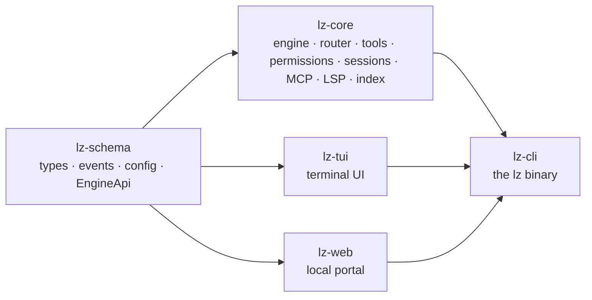
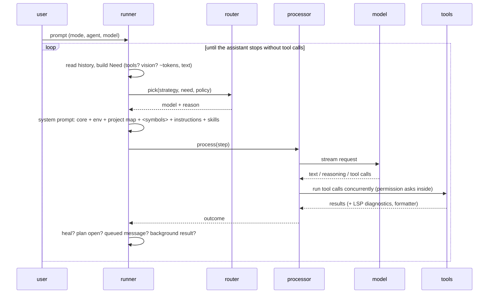
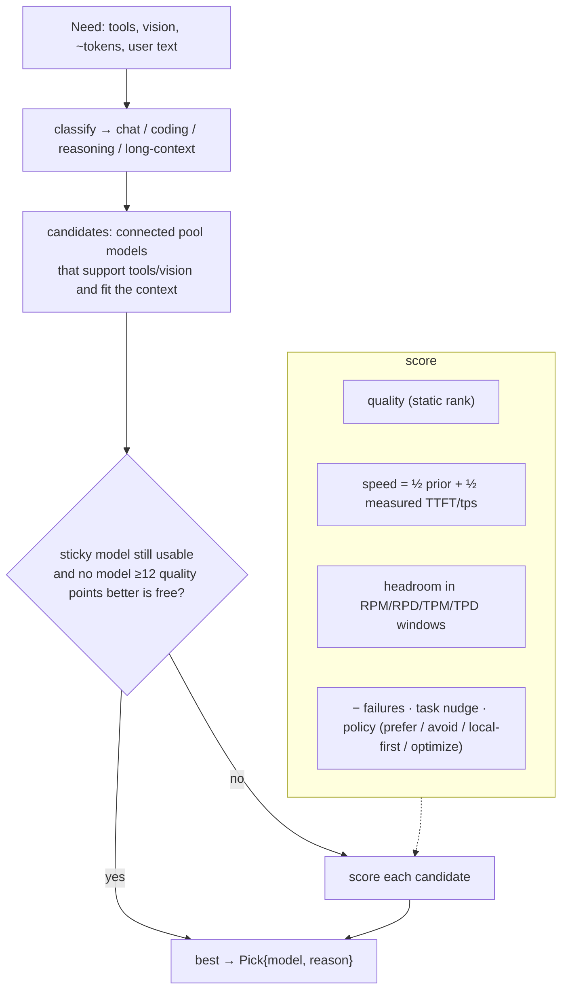
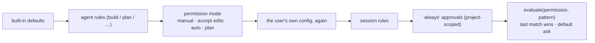
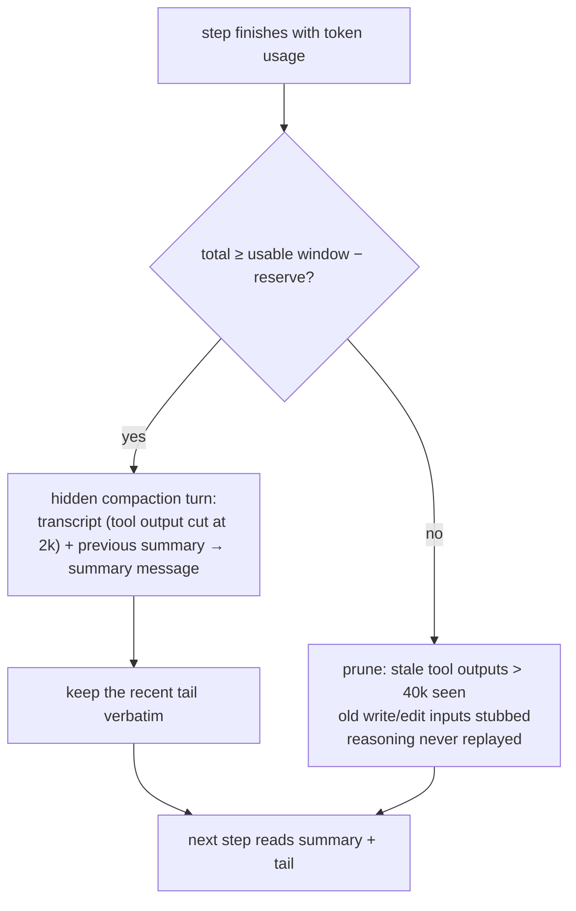
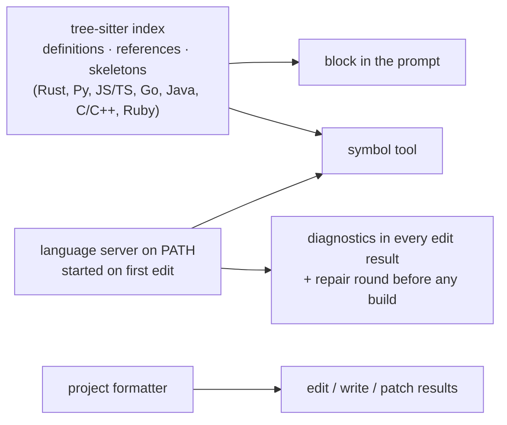

# Architecture

Four crates, one direction of dependency:

The TUI and the portal never touch `lz-core` directly: they talk to the
`EngineApi` trait and subscribe to the event bus. One process hosts all of
them; the portal shares the engine the terminal is using, which is why a
permission answered in the browser resolves in the terminal.

## A turn

Three things keep a turn honest after the model has "finished":

- **heal** — the last check command failed, or an edited file still has language-server errors → a hidden repair message and another step (`heal.max_rounds`).
- **plan** — the model's own todo list has open items and it did not ask a question → sent back to them (twice at most).
- **queued input** — a message the user typed mid-turn, or a background subagent's result, is already the newest user turn; the loop simply continues.

## The router

`lunar/auto` is a virtual model. Every request builds a `Need` and the router
picks a real model from the connected free-tier members.

Every model has a ledger entry (persisted in `~/.local/state/lunarzero/quota.json`):
request timestamps, token counts, cooldown, failure streak, last error,
measured latency. `blocked()` explains, in words, why a model cannot serve a
request right now; `lz pool why` prints it.

Failure handling is deliberately not a retry loop:

```mermaid
stateDiagram-v2
  [*] --> Ready
  Ready --> Cooling: 429 (retry-after → exact wait; daily cap → UTC midnight;<br/>else backoff 1·2·4… min, capped at 1 h)
  Ready --> Cooling: 5xx / timeout (30 s·2ⁿ, capped at 15 min)
  Ready --> Cooling: 404 model gone (24 h) · 400/422 (30 min) · too large (3 min)
  Ready --> ProviderCooling: 401/403 — the whole provider, 1 h
  Cooling --> Ready: cooldown elapsed
  ProviderCooling --> Ready: 1 h
  Ready --> Ready: success resets the streak
```

When a request fails **before any output streamed**, the processor asks the
router for the next model immediately (excluding the ones already tried this
step) and rebuilds the request for it — that is the 2 ms failover in
`BENCHMARKS.md`. When *every* candidate is blocked, the router reports the one
that frees up soonest and the step waits for it (bounded), then explains
exhaustion instead of spinning.

## Permissions

A rule is `{permission, pattern, action}`; patterns are anchored globs
(`*` → anything, `?` → one char, trailing ` *` also matches the bare command)
with regex metacharacters taken literally. `bash` patterns are the command's
*prefix* by arity (`git checkout main` → `git checkout`) so an "always" approval
never widens to the whole binary for dangerous commands (`rm -rf /` → `rm`).

Modes sit between the agent's rules and the user's config, and the user's
config is re-applied after them: a mode can tighten defaults but cannot
override an explicit allow or deny. A *forced* ask — installing third-party
code the user did not request — bypasses all of it and needs a human; with
nobody there (`--auto`) it is refused.

## Compaction

The window is the *routed* model's context, not the virtual `lunar/auto`
placeholder — the sidebar percentage and the overflow check use the same
number. Skill outputs are protected from pruning; everything the model may
still need to quote (the last three assistant steps' inputs) is kept intact.

## Index and diagnostics

The index is refreshed by mtime and cached on disk; a step never waits on a
cold index (it takes what is there). The language server's readiness is
tracked through `$/progress`, diagnostics are matched to the document version
that was sent, and `workspace/symbol` + `references` back the `symbol` tool for
anything the index does not model.
